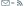
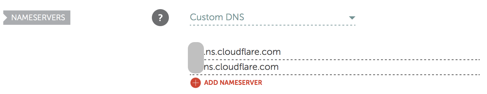
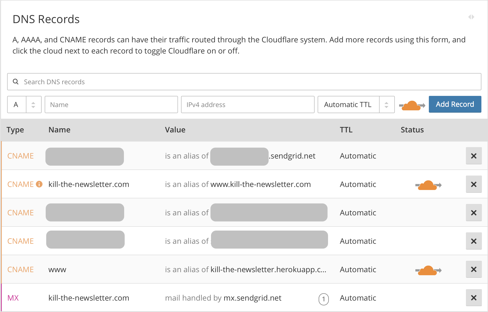
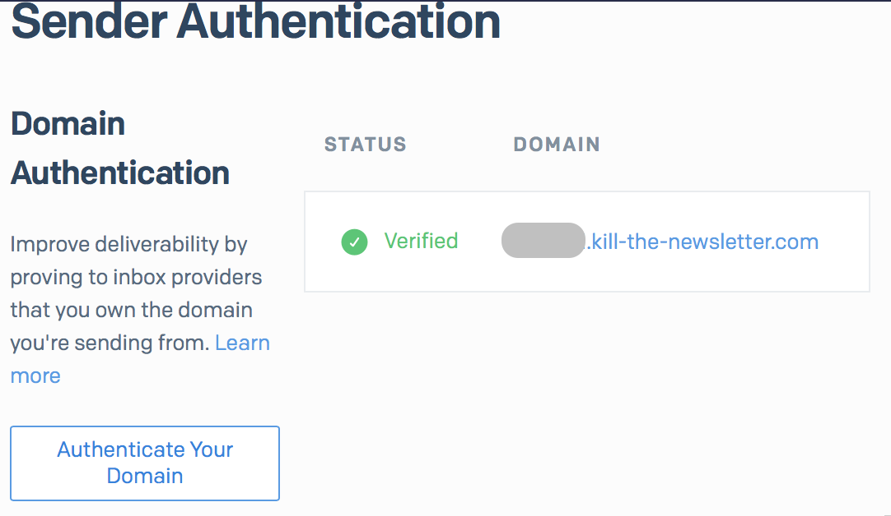
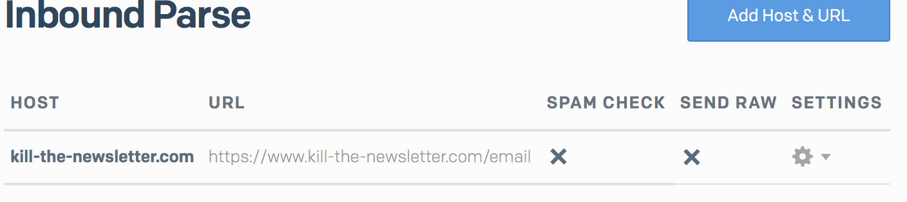

Kill the Newsletter!
====================



Convert email newsletters into Atom feeds.

https://www.kill-the-newsletter.com

|||
|-|-|
| Version | [0.0.3](#0.0.3) |
| Documentation | [GitHub](https://github.com/leafac/kill-the-newsletter#readme) |
| License | [GNU General Public License Version 3](https://gnu.org/licenses/gpl-3.0.txt) |
| Code of Conduct | [Contributor Covenant v1.4.0](http://contributor-covenant.org/version/1/4/) |
| Source | [GitHub](https://github.com/leafac/kill-the-newsletter) |
| Bug Reports | [GitHub Issues](https://github.com/leafac/kill-the-newsletter/issues) |
| Contributions | [GitHub Pull Requests](https://github.com/leafac/kill-the-newsletter/pulls) |
| Author | [Leandro Facchinetti](https://www.leafac.com) |

Infrastructure
--------------

|||
|-|-|
| Domain | [NameCheap](https://www.namecheap.com) |
| Hosting | [Heroku](https://www.heroku.com) |
| HTTPS for free Heroku dyno | [Cloudflare](https://www.cloudflare.com) |
| Receive Emails | [SendGrid’s Inbound Parse Webhook](https://sendgrid.com/docs/User_Guide/Settings/parse.html) |
| Store Feeds | [Backblaze B2 Cloud Storage](https://www.backblaze.com/b2/cloud-storage.html) |

Setup
-----

1. Create accounts in [Infrastructure](#infrastructure) services.

2. [**NameCheap**] Buy domain.

3. [**Heroku**] Create new app.

4. [**Heroku**] Add custom domain.

5. [**Heroku**] Add SendGrid add-on.

6. [**SendGrid**] Start to authenticate domain at Sender Authentication (verification will happen at step 11).

7. [**Cloudflare**] Add site.

8. [**NameCheap**] Configure Cloudflare as nameserver.

   

9. [**Cloudflare**] Activate site.

10. [**Cloudflare**] Configure DNS (SendGrid’s DNS records from step 6 are grayed out):

    

11. [**SendGrid**] Verify Sender Authentication.

    

12. [**SendGrid**] Create Inbound Parse endpoint at `<URL>/email` (`<URL>` must match value in [Configuration](#configuration)).

    

13. [**Backblaze**] Create bucket.

14. [**Heroku**] Set Config Vars following [Configuration](#configuration).

Run Locally
-----------

1. Create `.env` file following [Configuration](#configuration).
2. Run with `heroku local`.
3. Simulate SendGrid’s Inbound Parse Webhook:

   ```shell
   $ curl --request POST \
          --url http://localhost:5000/email \
          --form 'charsets={}' \
          --form 'from=GLaDOS <glados@example.com>' \
          --form 'envelope={"to":["cfni8kcr4oqalfwgechq@localhost"]}' \
          --form 'subject=Come to the party' \
          --form 'text=There will be *cake*' \
          --form 'html=There will be <em>cake</em>'
   ```

Configuration
-------------

| Environment Variable | Description | Example | Default Value | Required |
|-|-|-|-|-|
| `B2_ACCOUNT_ID` | Backblaze B2 Cloud Storage Account ID | `b59189777aec` | | ✓ |
| `B2_APPLICATION_KEY` | Backblaze B2 Cloud Storage Application Key | `5dc69b45c8661d6de1c52f45766e989638d7157179` | | ✓ |
| `B2_BUCKET` | Backblaze B2 Cloud Storage Bucket | `kill-the-newsletter` | | ✓ |
| `NAME` | Display name | | `Kill the Newsletter!` | |
| `URL` | Service URL | `https://www.kill-the-newsletter.com` | `http://localhost:5000` | |
| `EMAIL_DOMAIN` | Domain to receive emails | `kill-the-newsletter.com` | `localhost` | |
| `URN` | URN used in feeds ids | | `kill-the-newsletter` | |
| `ADMINISTRATOR_EMAIL` | Email address for support requests | `administrator@example.com` | `kill-the-newsletter@leafac.com` | |
